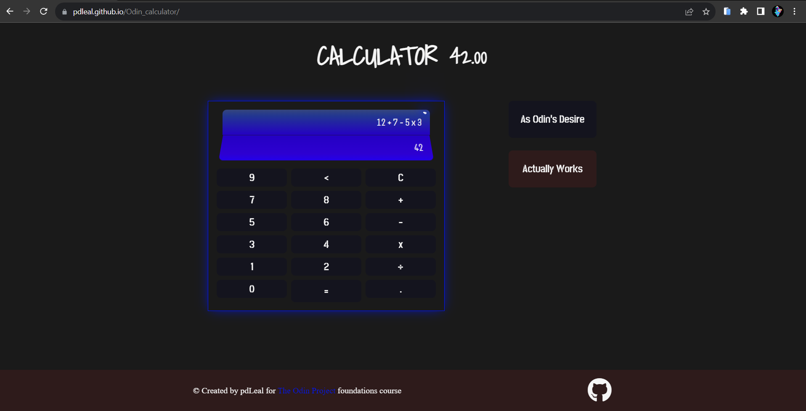
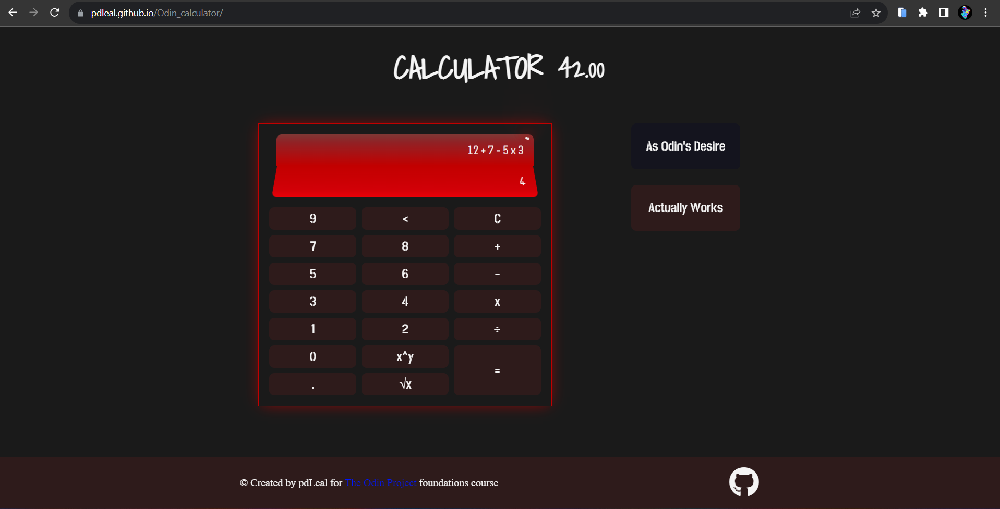

<h1 align="center">Odin's Calculator 📔</h1>

> This project was build, at first, fallowing the path set by <a href="https://www.theodinproject.com/lessons/foundations-calculator">The Odin Project</a>. A simple calculator, able to do simple operations, one at time and without any priority. And this was botthering me...If I'm going to make a calculator it should at least do multiplication and division first, as I was taught since I started learning math.

 

> So I bangged my head against the keyboard util it was able to make 1 + 1 * 2 = 3 and not 4. And then made the calculator be albe to handle square root and power operations. And then I had to force myself to stop before I tried make it a scientific calculator. I not even good at math, I have no clue how such calculators works. :trollface:

Live Demo ---> <a href="https://pdleal.github.io/Odin_calculator/">Odin's Calculator</a>

